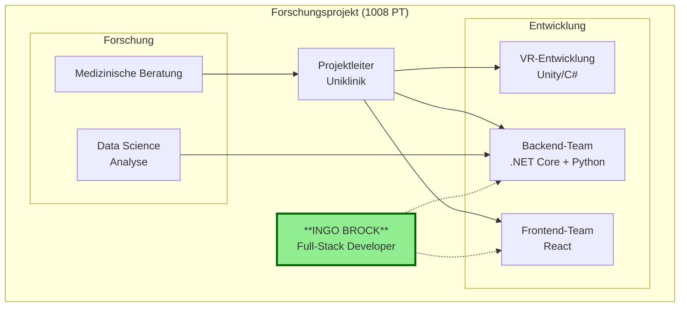
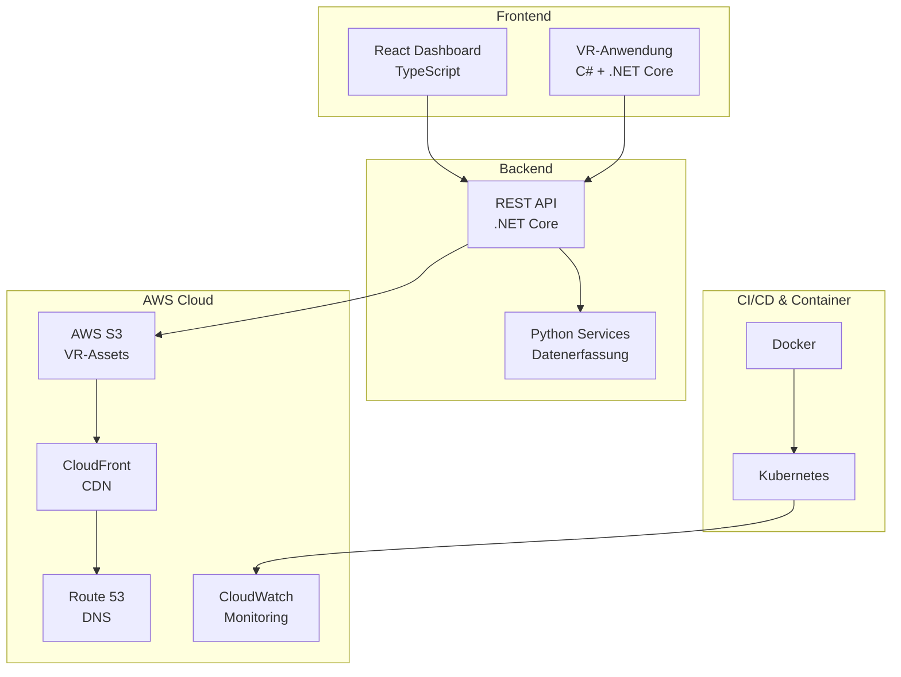

# Projekt-Steckbrief: Uniklinik Mannheim - Therapeutische VR-Umgebung

**Kunde:** Forschungsprojekt mit der Uniklinik Mannheim  
**Branche:** Healthcare  
**Zeitraum:** 09/2023 - 05/2024 (8 Monate)  
**Meine Rolle:** Developer

---

## Projekt auf einen Blick

**Was war das Ziel?**
Entwicklung einer VR-Anwendung zur Unterstützung von Patienten bei der Bewältigung von Angst und Unwohlsein während medizinischer Eingriffe. Integration von Benutzerfeedback und KPIs zur Messung des Therapieerfolgs.

**Was war mein Beitrag?**
Frontend-Entwicklung mit React/TypeScript für Feedback-Integration und KPI-Dashboards. VR-Umgebungsoptimierung mit C# und .NET Core. Python-basierte Dienste für anonymisierte Datenerfassung (DSGVO-konform). CI/CD-Implementierung mit Docker und Kubernetes.

**Was war das Ergebnis?**
Verbesserte Messbarkeit des Therapieerfolgs durch integrierte KPIs. Reibungslose VR-Erfahrung mit niedriger Latenz. Gewährleistung des Datenschutzes sensibler Patientendaten gemäß DSGVO.

---

## Team-Struktur

**Team-Details:**  
- **Gesamtgröße:** ~15 Personen (1008 PT über 8 Monate)  
- **Mein direktes Team:** 3-4 Entwickler  
- **Zusammenarbeit mit:** Medizinische Berater, Data Science  
- **Besonderheit:** Forschungsprojekt mit Uniklinik

---

## Technische Architektur

**Architektur-Highlights:**  
- **Architekturstil:** Hybrid (VR-App + Web-Dashboard + Cloud-Backend)  
- **Besonderheiten:** Hochverfügbare AWS-Infrastruktur für VR-Assets  
- **Herausforderungen:** Niedrige Latenz für VR, DSGVO-Compliance für Patientendaten

---

## Technologie-Stack

### Übersicht nach Kategorien

| Kategorie | Technologien | Meine Erfahrung |
|-----------|--------------|-----------------|
| **Programmiersprachen** | C#, TypeScript, Python | ⭐⭐⭐⭐⭐ |
| **Frontend** | React, TypeScript, Hooks | ⭐⭐⭐⭐⭐ |
| **Backend** | .NET Core | ⭐⭐⭐⭐⭐ |
| **Cloud/AWS** | S3, CloudFront, Route 53, CloudWatch | ⭐⭐⭐⭐ |
| **DevOps** | Docker, Kubernetes | ⭐⭐⭐⭐⭐ |
| **Testing** | xUnit, Cypress | ⭐⭐⭐⭐ |
| **Tools** | Confluence | ⭐⭐⭐⭐ |

### Technologie-Deep-Dive

**React + TypeScript:**  
- Eingesetzt für: Feedback-Integration, KPI-Dashboards für Therapeuten  
- Besonderheit: React Hooks, TypeScript Interfaces für präzise Typisierung  
- Erfahrungslevel: Expert

**.NET Core / C#:**  
- Eingesetzt für: VR-Umgebungsoptimierung, REST APIs  
- Besonderheit: Niedrige Latenz für reibungslose VR-Interaktion  
- Erfahrungslevel: Expert

**Python:**  
- Eingesetzt für: Anonymisierte Datenerfassung und -analyse  
- Besonderheit: DSGVO-konforme Verarbeitung von Patientendaten  
- Erfahrungslevel: Intermediate

---

## Agile Arbeitsweise

### Methodik
- **Framework:** Scrum (angepasst für Forschungsprojekt)
- **Sprint-Länge:** 2 Wochen
- **Release-Zyklus:** CI/CD mit Docker und Kubernetes

### Team-Abstimmung

**Wie wurde kommuniziert?**  
- **Synchron:** Regelmäßige Calls mit Uniklinik  
- **Asynchron:** Confluence für Dokumentation  
- **Besonderheit:** Enge Abstimmung mit medizinischen Beratern

**Typischer Arbeitstag:**  
> Morgens Daily mit dem Dev-Team. Vormittags Entwicklung - oft React-Dashboards für Therapeuten. Mittags manchmal Abstimmung mit der Uniklinik zu fachlichen Anforderungen. Nachmittags Backend-Arbeit und Tests. Bei Datenschutz-Fragen enge Abstimmung mit dem Legal-Team.

---

## Relevanz für DB Systel - Rechnungsbahnhof

### Direkte Übertragbarkeit

| Anforderung aus Ausschreibung | Erfahrung aus diesem Projekt |
|-------------------------------|------------------------------|
| .NET (5+ Jahre) | ✅ .NET Core für VR-Backend und APIs |
| C# (5+ Jahre) | ✅ VR-Optimierung und Backend |
| React (5+ Jahre) | ✅ KPI-Dashboards mit TypeScript |
| CI/CD Pipeline (3+ Jahre) | ✅ Docker + Kubernetes CI/CD |
| Container Orchestration (3+ Jahre) | ✅ Kubernetes für Production |
| Cypress/xUnit (3+ Jahre) | ✅ Beide Test-Frameworks eingesetzt |
| Confluence (1+ Jahr) | ✅ DSGVO-Dokumentation |

### Key Talking Points für Interview

1. **Datenschutz-Erfahrung:** DSGVO-konforme Verarbeitung sensibler Daten - relevant für DB
2. **AWS-Infrastruktur:** CloudFront, S3, Route 53, CloudWatch
3. **Performance-Kritisch:** Niedrige Latenz für VR - zeigt Optimierungs-Skills
4. **Forschungsprojekt:** Wissenschaftliche Arbeitsweise, Dokumentation

---

## Projekt-Kennzahlen

- **Projektgröße:** 1008 PT
- **Team-Größe:** ~15 Personen
- **Meine Beteiligung:** 8 Monate Vollzeit
- **AWS-Dienste:** 4 (S3, CloudFront, Route 53, CloudWatch)
- **Compliance:** DSGVO für sensible Patientendaten
