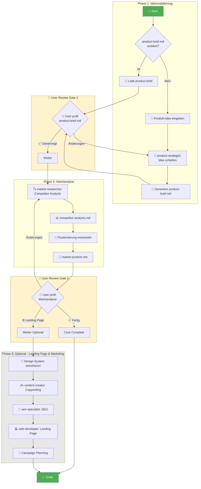
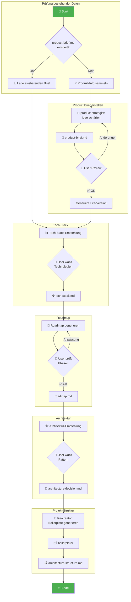
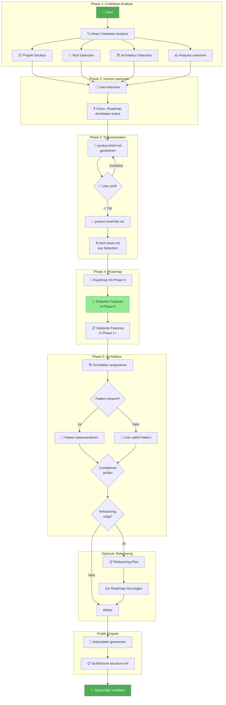
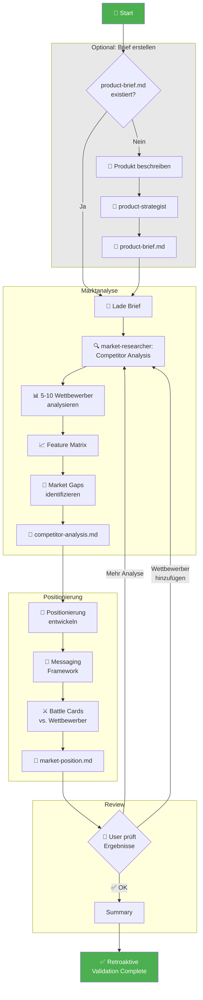
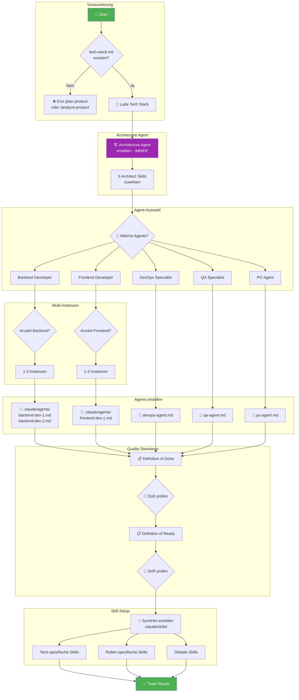

# Workflow Diagramme

Diese Datei enthält Mermaid-Diagramme für alle aktualisierten Workflows.

---

## 1. validate-market Workflow



**Outputs:**
- 📄 product-brief.md (Pflicht)
- 📊 competitor-analysis.md (Pflicht)
- 📍 market-position.md (Pflicht)
- 🎨 design-system.md (Optional)
- 🌐 landing-page/index.html (Optional)
- 📢 ad-campaigns.md (Optional)

---

## 2. plan-product Workflow



**Outputs:**
- 📄 product-brief.md
- 📄 product-brief-lite.md
- ⚙️ tech-stack.md
- 📅 roadmap.md
- 📐 architecture-decision.md
- 📋 architecture-structure.md
- 📁 boilerplate/ (Ordnerstruktur)

---

## 3. analyze-product Workflow



**Besonderheit:** Phase 0 enthält bereits implementierte Features!

---

## 4. validate-market-for-existing Workflow



**Use Cases:**
- 🚀 Produkt ohne Validierung gestartet
- 🔄 Pivot-Validierung
- 📢 Marketing-Refresh
- 💰 Investment-Vorbereitung

---

## 5. build-development-team Workflow



**Team-Optionen:**
| Agent | Required | Skills | Multi-Instanz |
|-------|----------|--------|---------------|
| 🏗️ Architecture | ✅ Ja | 5 | Nein |
| 💻 Backend | Optional | 4+ | Ja (1-3) |
| 🎨 Frontend | Optional | 4+ | Ja (1-3) |
| ⚙️ DevOps | Optional | 4 | Nein |
| 🧪 QA | Optional | 2 | Nein |
| 📋 PO | Optional | 4 | Nein |

---

## 6. Kombinierte Nutzung - Kompletter Lifecycle

```mermaid
flowchart TD
    subgraph NewProject["Neues Projekt"]
        A[💡 Neue Idee] --> B[/validate-market]
        B --> C[📄 product-brief.md\n📊 competitor-analysis.md\n📍 market-position.md]
        C --> D{GO / NO-GO?}
        D -->|NO-GO| E[❌ Idee verwerfen\noder anpassen]
        D -->|GO| F[/plan-product]
    end

    subgraph Planning["Planung"]
        F --> G[📄 Nutzt product-brief.md]
        G --> H[⚙️ tech-stack.md\n📅 roadmap.md\n📐 architecture-decision.md\n📁 boilerplate/]
    end

    subgraph TeamSetup["Team Setup"]
        H --> I[/build-development-team]
        I --> J[🏗️ Architecture Agent\n💻 Backend Agent\n🎨 Frontend Agent\n⚙️ DevOps Agent\n🧪 QA Agent\n📋 PO Agent]
        J --> K[📋 Definition of Done\n📋 Definition of Ready]
    end

    subgraph Development["Entwicklung"]
        K --> L[/create-spec]
        L --> M[Feature Spec]
        M --> N[/execute-tasks]
        N --> O[Implementation]
        O --> P{Tests bestanden?}
        P -->|Nein| N
        P -->|Ja| Q[Feature Complete]
        Q --> L
    end

    subgraph ExistingProject["Bestehendes Projekt"]
        AA[📦 Existierende\nCodebase] --> BB[/analyze-product]
        BB --> CC[📄 product-brief.md\n⚙️ tech-stack.md\n📅 roadmap.md mit Phase 0]
    end

    subgraph RetroValidation["Nachträgliche Validierung"]
        CC --> DD{Marktvalidierung\nnötig?}
        DD -->|Ja| EE[/validate-market-for-existing]
        EE --> FF[📊 competitor-analysis.md\n📍 market-position.md]
        DD -->|Nein| GG[Weiter]
        FF --> GG
    end

    GG --> I

    style A fill:#4CAF50,color:#fff
    style AA fill:#2196F3,color:#fff
    style D fill:#FF9800,color:#fff
    style Q fill:#4CAF50,color:#fff
```

---

## Legende

| Symbol | Bedeutung |
|--------|-----------|
| 🚀 | Start |
| ✅ | Ende / Erfolg |
| ❌ | Abbruch / Fehler |
| 🚦 | User Review Gate |
| 👤 | User-Interaktion |
| 🤖 | Agent-Aktion |
| 📄 | Dokument |
| 📁 | Ordner |
| 🔗 | Symlink |

---

## Workflow-Auswahl Guide

```mermaid
flowchart TD
    A[Wo stehe ich?] --> B{Projekt\nexistiert?}

    B -->|Nein, neue Idee| C{Marktvalidierung\ngewünscht?}
    C -->|Ja| D[/validate-market]
    C -->|Nein, direkt starten| E[/plan-product]
    D --> E

    B -->|Ja, bestehendes Projekt| F[/analyze-product]
    F --> G{Marktvalidierung\nnachträglich?}
    G -->|Ja| H[/validate-market-for-existing]
    G -->|Nein| I[Weiter]
    H --> I

    E --> J[/build-development-team]
    I --> J

    J --> K[🚀 Bereit für Entwicklung]
    K --> L[/create-spec → /execute-tasks]

    style D fill:#FF9800
    style E fill:#2196F3
    style F fill:#9C27B0
    style H fill:#FF9800
    style J fill:#4CAF50
    style K fill:#4CAF50,color:#fff
```
